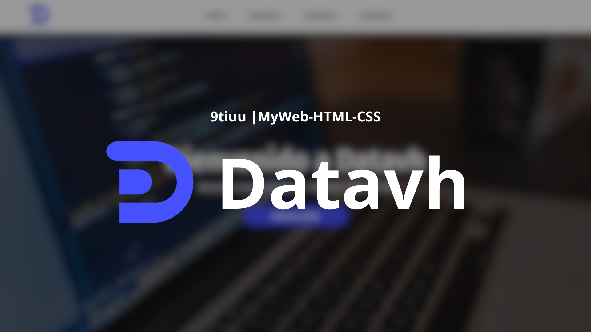

<h3 align="center">9tiuu | MyWeb-HTML-CSS</h3>

---

# Introducción

Este repositorio fue creado con el objetivo de compartir una plantilla básica creada por mi, utilizando  y . Los elementos descargados como iconos e imágenes, he utilizado <a href="https://www.flaticon.es/uicons/interface-icons">flaticon</a> y <a href="https://www.canva.com/es_es/">canva</a>. 

